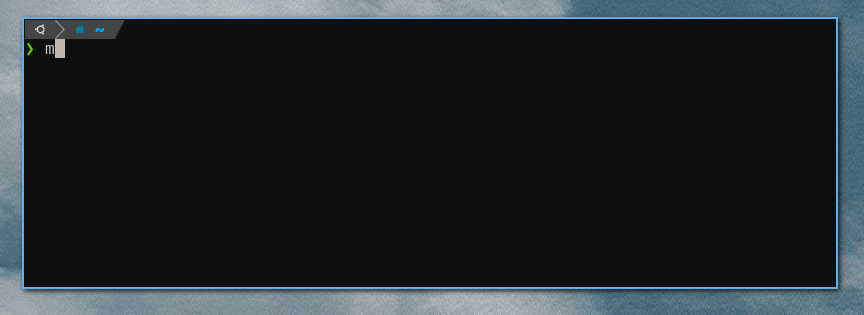

# Memit

Execute a binary from memory, without touching the disk. Linux only.

Available as both a Go module and a binary.



## Using the Go module

The `Command()` method takes an `io.Reader`, so you can use it with things like an HTTP response body, a `bytes.Buffer`, etc.

It provides an `*exec.Cmd` (via `memit.Command(...)` so you can wire up stdin/out and configure other parameters just like you would with a regular command.

```go
package main

import "github.com/liamg/memit"

func main() {
	resp, _ := http.Get("https://.../mybinary")

	cmd, _, _ := memit.Command(resp.Body, "--args", "--go", "--here")

	cmd.Stderr = os.Stderr
	cmd.Stdin = os.Stdin
	cmd.Stdout = os.Stdout

	_ = cmd.Run()
}
```

## Using the binary

Grab the [latest release](https://liamg/memit/releases/latest) and run it like this:

```bash
memit https://.../mybinary -- # args for the actual binary can be put after the --
```


